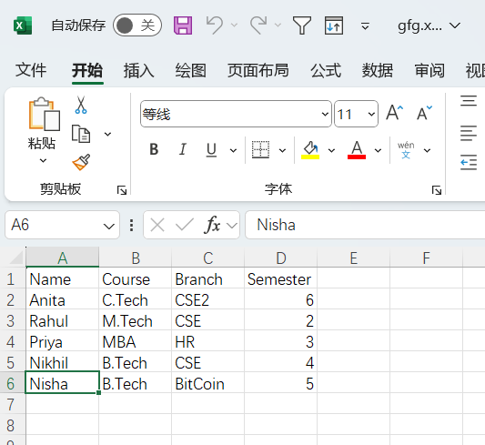

## Python acess excel file

### you need to install openpyxl,use command: pip install openpyxl

### openpyxl guid: https://www.datacamp.com/tutorial/python-excel-tutorial




```python
import openpyxl as oxl

# Give the location of the file
path="gfg.xlsx"
# To open the workbook
# workbook object is created
wb = oxl.load_workbook(path)
# Get workbook active sheet object
# from the active attribute
ws = wb.active
# read data from one cell
print(ws["a1"].value)
```

    Name


```python
#get the total rows
rows = ws.max_row # property,not function
cols = ws.max_column # property,not function
print(f"This doc has {rows} rows and {cols} columns")
```

    This doc has 6 rows and 4 columns


```python
# get a row of data
row_values = [ws.cell(row=2,column=i).value for i in range(1,cols+1)]
print(row_values)
```

    ['Anita', 'C.Tech', 'CSE2', 6]


```python
# get a column of data
col_values = [ws.cell(row=i,column=1).value for i in range(1,rows+1)]
for val in col_values:
    print(val)
```

    Name
    Anita
    Rahul
    Priya
    Nikhil
    Nisha


```python
# iteration way1
for i in range(1,rows+1):
    for j in range(1,cols+1):
        val=ws.cell(i,j).value
        print(f"{val}",end="\t")
    print()   
```

    Name	Course	Branch	Semester	
    Anita	C.Tech	CSE2	6	
    Rahul	M.Tech	CSE	2	
    Priya	MBA	HR	3	
    Nikhil	B.Tech	CSE	4	
    Nisha	B.Tech	BitCoin	5	


```python
# iteration way2
for x in ws.iter_rows(min_row=1,max_row=rows,min_col=1,max_col=cols):
    for y in x:
        print(y.value,end="\t")
    print()   
```

    Name	Course	Branch	Semester	
    Anita	C.Tech	CSE2	6	
    Rahul	M.Tech	CSE	2	
    Priya	MBA	HR	3	
    Nikhil	B.Tech	CSE	4	
    Nisha	B.Tech	BitCoin	5	


```python
# encapsulate a function
def show_excel_data(xlsxpath,sheet):
    wb = oxl.load_workbook(xlsxpath)
    ws = wb[sheet]
    rows = ws.max_row # property,not function
    cols = ws.max_column # property,not function
    for x in ws.iter_rows(min_row=1,max_row=rows,min_col=1,max_col=cols):
        for y in x:
            print(y.value,end="\t")
        print()   
    wb.close()
```


```python
# update data
path="gfg.xlsx"
# To open the workbook
# workbook object is created
wb = oxl.load_workbook(path)
# Get workbook active sheet object
# from the active attribute
ws = wb.active
ws.cell(2,1).value = "Anita2"
ws.cell(2,2).value = "B.Tech"
ws.cell(2,3).value = "CSE3"
ws.cell(2,4).value = 5
ws.title="Technician" #change the worksheet name ("title")
wb.save("gfgm.xlsx")
wb.close()
```


```python
show_excel_data("gfgm.xlsx","Technician")
```

    Name	Course	Branch	Semester	
    Anita2	B.Tech	CSE3	5	
    Rahul	M.Tech	CSE	2	
    Priya	MBA	HR	3	
    Nikhil	B.Tech	CSE	4	
    Nisha	B.Tech	BitCoin	5	


```python
import openpyxl as oxl
wb = oxl.load_workbook("gfg.xlsx")
wb.create_sheet("student")

#add data to the empty sheet, we can just create a nested list as data ,and each element as a row ,then us worksheet object.append()
# to add to the sheet
rowdatas=[
         ["Id","Name","Gender","Age"],
         ["1001","Jessica","female",18],
          ["1002","Jade","female",19],
          ["1003","Ben","male",18],
          ["1004","Jason","male",17],
          ["1005","Miky","male",16]
         ]
# add data    
for x in rowdatas:
    wb["student"].append(x)


wb.save("gfg2.xlsx")  
wb.close()
```


```python
show_excel_data("gfg2.xlsx","student")
```

    Id	Name	Gender	Age	
    1001	Jessica	female	18	
    1002	Jade	female	19	
    1003	Ben	male	18	
    1004	Jason	male	17	
    1005	Miky	male	16	


```python
show_excel_data("gfg.xlsx","Technician")
```

    Name	Course	Branch	Semester	
    Anita	C.Tech	CSE2	6	
    Rahul	M.Tech	CSE	2	
    Priya	MBA	HR	3	
    Nikhil	B.Tech	CSE	4	
    Nisha	B.Tech	BitCoin	5	


```python
# use openpyxl create an excel file
import openpyxl as oxl
wb = oxl.Workbook()
ws = wb.active
ws.title="Employee"
datas = [
         ["Id","   Name   ","Gender","Age"],
         ["E001","Jessica Jade","female",28],
          ["E002","Joana Lee","female",29],
          ["E003","Ben Scott","male",28],
          ["E004","Jason Coop","male",27],
          ["E005","Miky Smith","male",26]
]
for x in datas:
    ws.append(x)
wb.save("data.xlsx")
```


```python
# read the data 
show_excel_data("data.xlsx","Employee")
```

    Id	   Name   	Gender	Age	
    E001	Jessica Jade	female	28	
    E002	Joana Lee	female	29	
    E003	Ben Scott	male	28	
    E004	Jason Coop	male	27	
    E005	Miky Smith	male	26	


## 