## 1.在mysql控制台里面创建一个数据库和一个数据表,要求如下

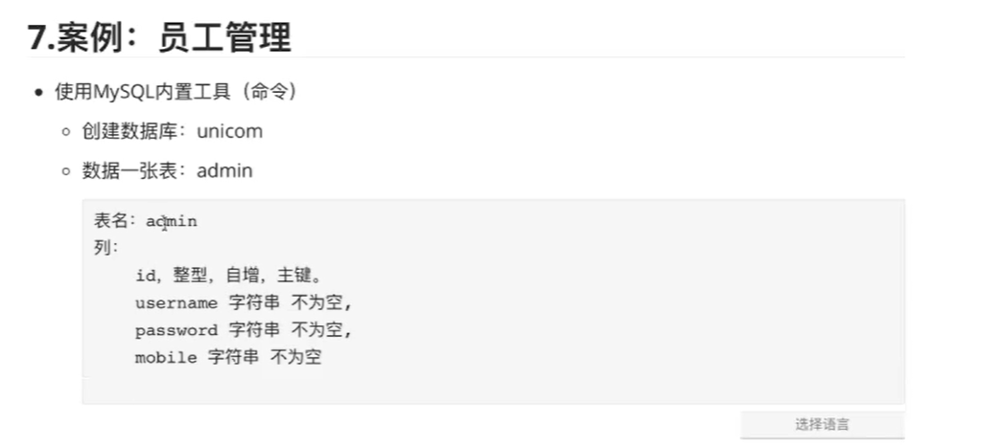

### 用navicat来创建比较方便,注意编码要用utf-8,在mysql中是utf8

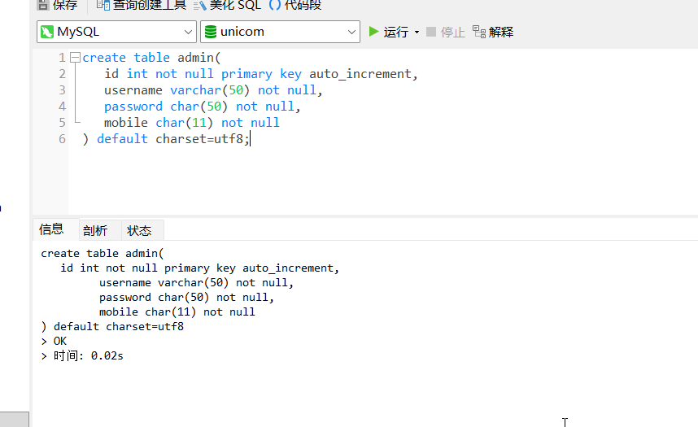

### 创建完成后用mysql命令行工具也可以查看到数据库和表,只是没有数据

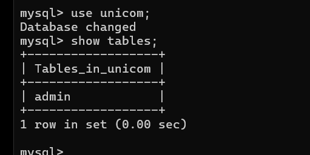

### 这是老师的答案,和我的大概一样

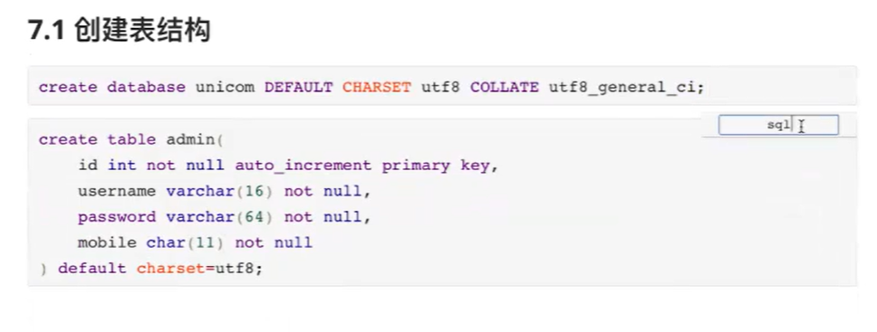

## 2.用Python代码来实现增删改查

### 1)新增数据

+ 首先需要安装pymysql,这是python的MySQL数据库驱动包,注意我的是python而不是python3.9

  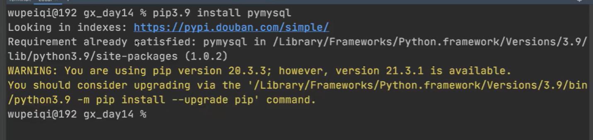

+ 然后我们就可以写一些python脚本来操作数据库了(当然这是本地操作还不是web方式),这里我们创建了一个python-mysql-crud文件夹,在里面创建一个pymysql-add.py文件,内容如下

  ```python
  import pymysql
  
  # 1.连接MySQL数据库
  host = "127.0.0.1"
  port = 3306
  user = "root"
  pwd = "root"
  charset = "utf8"
  db = "unicom"
  
  # 创建数据库连接对象
  conn = pymysql.connect(host=host,port=port,user=user,passwd=pwd,charset=charset,db=db)
  # 创建游标对象用来存取数据
  cursor = conn.cursor(cursor=pymysql.cursors.DictCursor)
  
  # 2.发送指令
  # 1>比如新增一条数据
  sqlcmd = "insert into admin (username,password,mobile) values('Jackma','123','13532619997')"
  cursor.execute(sqlcmd)
  # 2>需要提交请求,否则无法成功
  conn.commit()
  # 3.关闭连接
  cursor.close()
  conn.close()
  
  ```

  + 运行代码,效果如下

    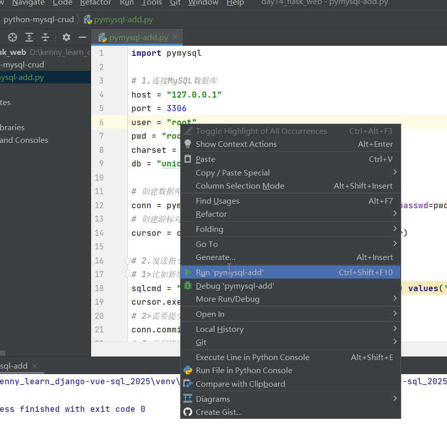

  + 没有报错,说明执行成功

    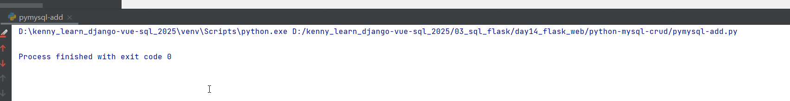


+ 然后我们用navicat查看一下,发现数据添加进来了

  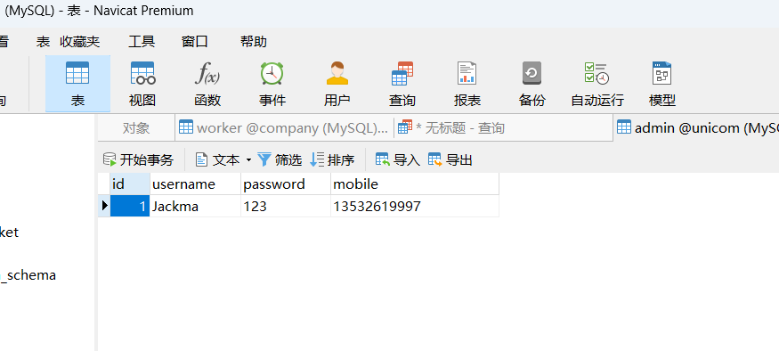

  

####  1>.预编译sql:不要用字符串格式化的方式来做sql语句的拼接,很危险,我们需要使用预编译sql

+ 我们把上面的代码中的sql定义和cursor执行代码的部分修改一下

  ```python+sql
  import pymysql
  
  # 1.连接MySQL数据库
  host = "127.0.0.1"
  port = 3306
  user = "root"
  pwd = "root"
  charset = "utf8"
  db = "unicom"
  
  # 创建数据库连接对象
  conn = pymysql.connect(host=host,port=port,user=user,passwd=pwd,charset=charset,db=db)
  # 创建游标对象用来存取数据
  cursor = conn.cursor(cursor=pymysql.cursors.DictCursor)
  
  # 2.发送指令
  # 1>比如新增一条数据
  # sqlcmd = "insert into admin (username,password,mobile) values('Jackma','123','13532619997')"
  # 1.2>使用预编译sql,先用占位符占位
  sqlcmd = "insert into admin (username,password,mobile) values(%s,%s,%s)"
  # 1.3> 然后定义一个数据元组
  data = ("PonyMa","456","13532618855") # 这里也可以使用列表[...]
  # 1.4 把数据传递进execte方法里面
  cursor.execute(sqlcmd,data)
  # 2>需要提交请求,否则无法成功
  conn.commit()
  # 3.关闭连接
  cursor.close()
  conn.close()
  
  ```

  + 运行程序,没有报错,说明是正确的.

    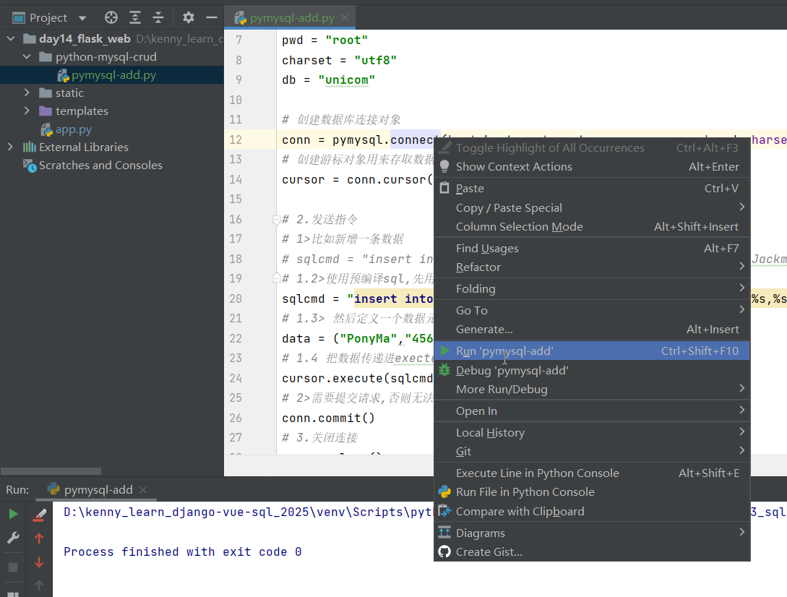

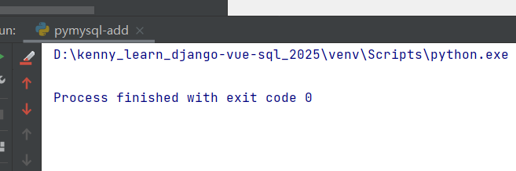


+ 然后我们可以在mysql终端或者navicat里面查看一下,数据进来了

  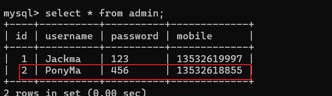

+ 还有一种写法,比较麻烦,需要使用字典来传递值

  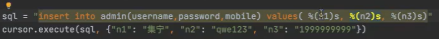

#### 2>然后我们可以尝试让用户输入数据,然后我们来添加数据,需要使用预编译sql

+ 我们先把这个文件复制一份,然后修改一下代码

  ```python+sql预编译
  import pymysql
  # pymysql操作数据库,使用用户输入的数据和预编译sql
  # 1.连接MySQL数据库
  host = "127.0.0.1"
  port = 3306
  user = "root"
  pwd = "root"
  charset = "utf8"
  db = "unicom"
  
  # 创建数据库连接对象
  conn = pymysql.connect(host=host,port=port,user=user,passwd=pwd,charset=charset,db=db)
  # 创建游标对象用来存取数据
  cursor = conn.cursor(cursor=pymysql.cursors.DictCursor)
  
  # 1.2让用户输入我们的数据:
  name = input("请输入用户名:")
  pwd = input("请输入密码:")
  ph = input("请输入手机号码")
  # 2.发送指令
  # 1>比如新增一条数据
  # sqlcmd = "insert into admin (username,password,mobile) values('Jackma','123','13532619997')"
  # 1.2>使用预编译sql,先用占位符占位
  sqlcmd = "insert into admin (username,password,mobile) values(%s,%s,%s)"
  # 1.3> 然后定义一个数据元组
  data = [name,pwd,ph]
  # 1.4 把数据传递进execte方法里面
  cursor.execute(sqlcmd,data)
  # 2>需要提交请求,否则无法成功
  conn.commit()
  # 3.关闭连接
  cursor.close()
  conn.close()
  
  ```

  

 #### 运行程序,没有报错,说明操作成功


+ 程序会提示用户输入

  

+ 然后我们查看一下navicat,发现数据的确是进来了

  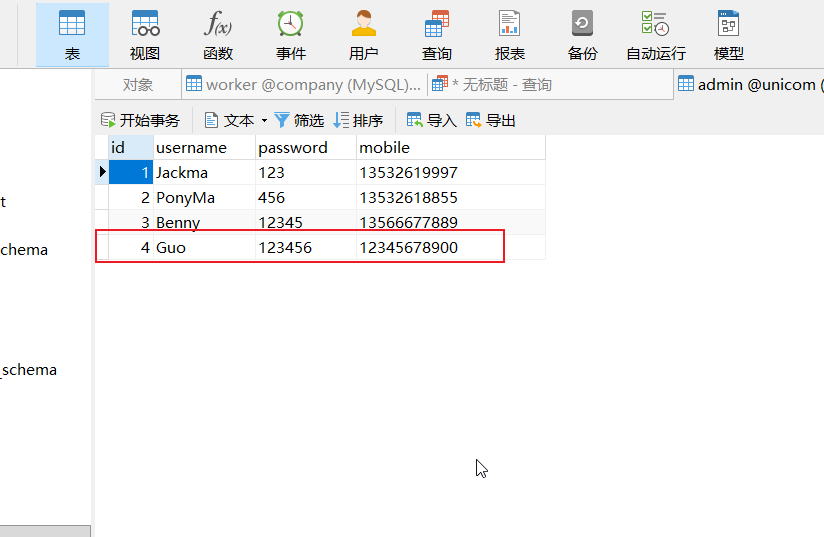

#### 当然,你也可以把它放到一个循环里面,我就不放了.

  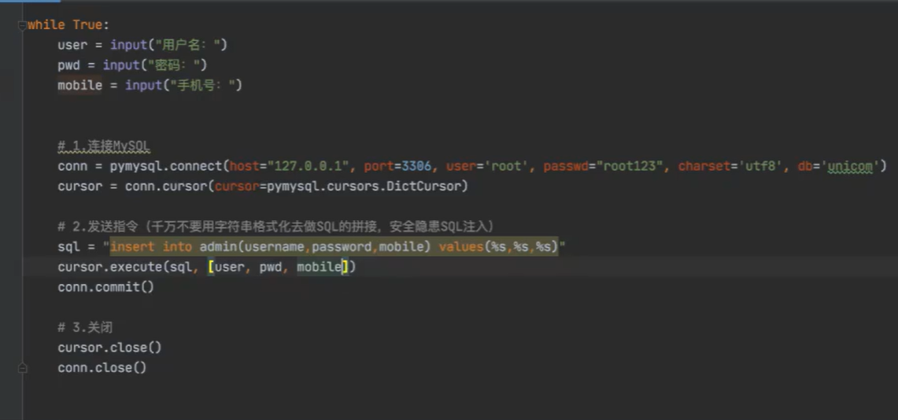

#### 注意:使用循环,你必须添加一个退出条件,不能让他无法退出

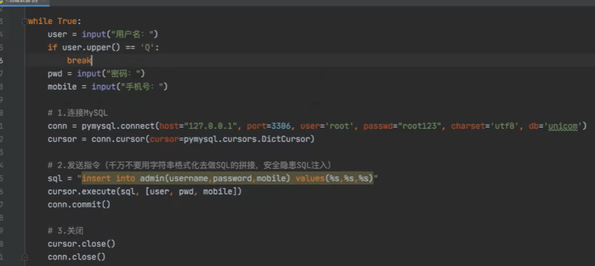


#### 以后我们都是这么操作sql

### 2)pymysql查询数据

#### 1>新建一个pymysql_query.py文件,用来练习查询,当然也需要使用预编译sql,我们需要更加不同的程序创建不同的函数.方便学习

##### 1.根据id查询的函数:query_by_id()

```python+pymysql
"""
利用pymysql来查询数据
"""
import pymysql
# pymysql操作数据库,使用用户输入的数据和预编译sql
# 1.连接MySQL数据库
host = "127.0.0.1"
port = 3306
user = "root"
pwd = "root"
charset = "utf8"
db = "unicom"

# 创建数据库连接对象
conn = pymysql.connect(host=host,port=port,user=user,passwd=pwd,charset=charset,db=db)
# 创建游标对象用来存取数据
cursor = conn.cursor(cursor=pymysql.cursors.DictCursor)

def query_by_id():
    id = input("请输入你需要查询的用户的id:")
    sql = "select * from admin where id=%s"
    cursor.execute(sql,[id])
    results = cursor.fetchall()# 先执行sql查询语句,然后在用cursor.fetchall()获取数据
    for res in results: # 这个返回值results是一个字典列表,每一个字典就是一行数据.
        print(res)

if __name__ == '__main__':
    query_by_id()
```

###### 运行程序效果如下

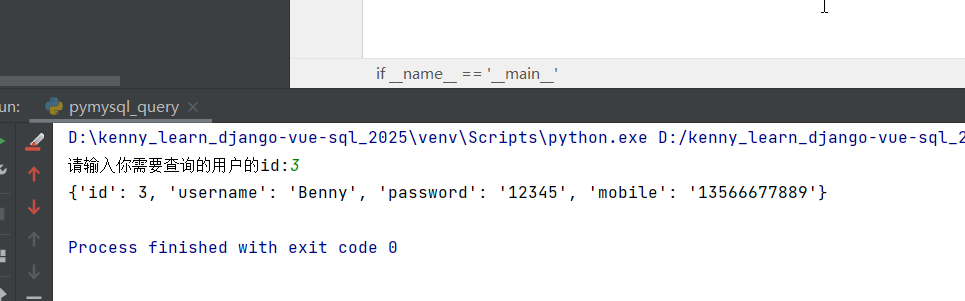

###### 可以去navicat看看数据是否正确

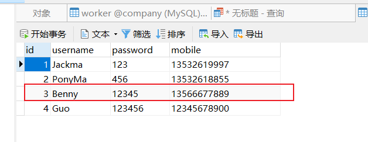

###### 数据是正确的,当然有fetchall就会有fetchone,只获取一条数据

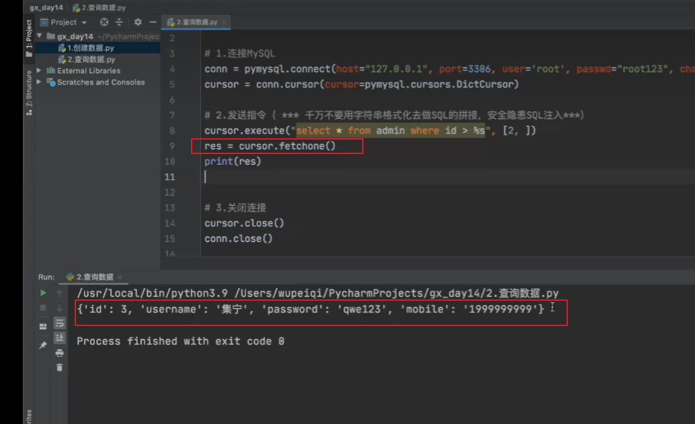

###### 当只有一条数据的时候,比如用户登录等等,就使用fetchone即可,否则效率很低

##### 其他的查询方法都是一样,参考这个就行了,用fetchall没有获取到数据会返回一个空列表[],用fetchone没有获取到数据会返回None,这个特点可以用来判断查询是否成功.

### 3)删除数据,新建一个pymsql_del.py文件来练习

为了方便学习,我们先添加一条数据,id为5.

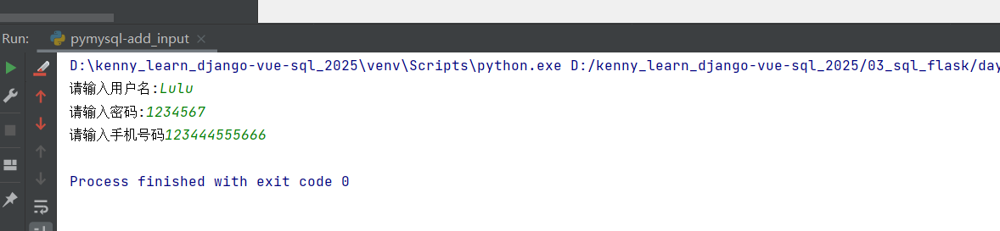

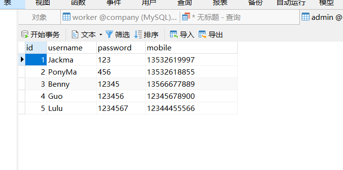


```python+pymysql
"""
利用pymysql来删除数据
"""
import pymysql
# pymysql操作数据库,使用用户输入的数据和预编译sql
# 1.连接MySQL数据库
host = "127.0.0.1"
port = 3306
user = "root"
pwd = "root"
charset = "utf8"
db = "unicom"

# 创建数据库连接对象
conn = pymysql.connect(host=host,port=port,user=user,passwd=pwd,charset=charset,db=db)
# 创建游标对象用来存取数据
cursor = conn.cursor(cursor=pymysql.cursors.DictCursor)

id = input("请输入需要删除的用户的id: ")
sql = "delete from admin where id=%s"
delid = cursor.execute(sql,[id,])
if delid:
    print("删除数据成功")

```

##### 运行程序

!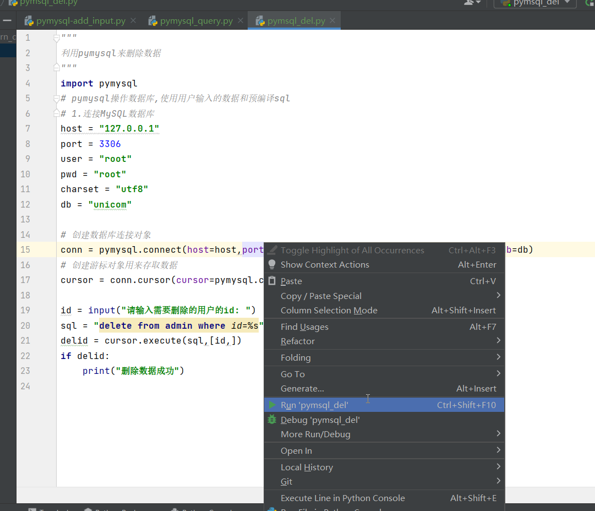

##### 提示输入删除id,然后提示删除成功

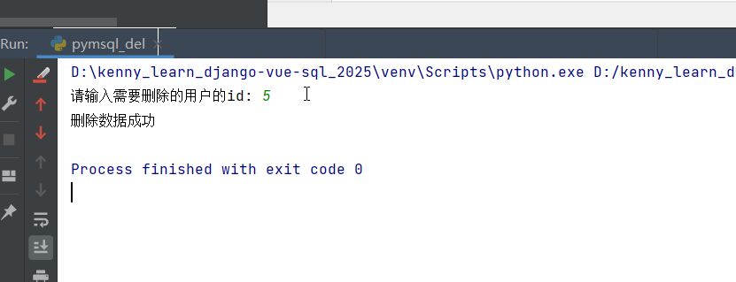

##### 我们到navicat里面看看,发现数据没有删除,

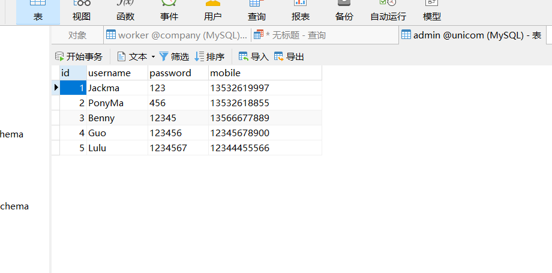


##### 我们修改一下代码添加提交功能

```python+pymysql
"""
利用pymysql来删除数据
"""
import pymysql
# pymysql操作数据库,使用用户输入的数据和预编译sql
# 1.连接MySQL数据库
host = "127.0.0.1"
port = 3306
user = "root"
pwd = "root"
charset = "utf8"
db = "unicom"

# 创建数据库连接对象
conn = pymysql.connect(host=host,port=port,user=user,passwd=pwd,charset=charset,db=db)
# 创建游标对象用来存取数据
cursor = conn.cursor(cursor=pymysql.cursors.DictCursor)

id = input("请输入需要删除的用户的id: ")
sql = "delete from admin where id=%s"
cursor.execute(sql,[id,])
conn.commit()
print("删除数据成功")

```

###### 运行程序,发现数据成功删除了

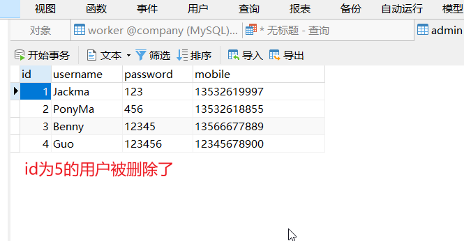

###### 说明凡是非查询的sql操作都需要执行提交动作

### 4)修改数据,我们新建一个pymysql_update.py文件来练习

```python+pymsql
"""
利用pymysql来修改数据
"""
import pymysql
# pymysql操作数据库,使用用户输入的数据和预编译sql
# 1.连接MySQL数据库
host = "127.0.0.1"
port = 3306
user = "root"
pwd = "root"
charset = "utf8"
db = "unicom"

# 创建数据库连接对象
conn = pymysql.connect(host=host,port=port,user=user,passwd=pwd,charset=charset,db=db)
# 创建游标对象用来存取数据
cursor = conn.cursor(cursor=pymysql.cursors.DictCursor)

id = input("请输入需要修改的用户的id: ")
name = input("请输入用户名: ")
pwd = input("请输入新密码: ")
ph = input("请输入新的电话号码: ")

sql = "update admin set username=%s,password=%s,mobile=%s where id=%s"
cursor.execute(sql,[name,pwd,ph,id])
conn.commit()

print("更新数据完成,请到数据库在查询结果...")
```

##### 运行程序,会提示你输入数据,比如我们修改id为2的用户信息,然后说执行完成

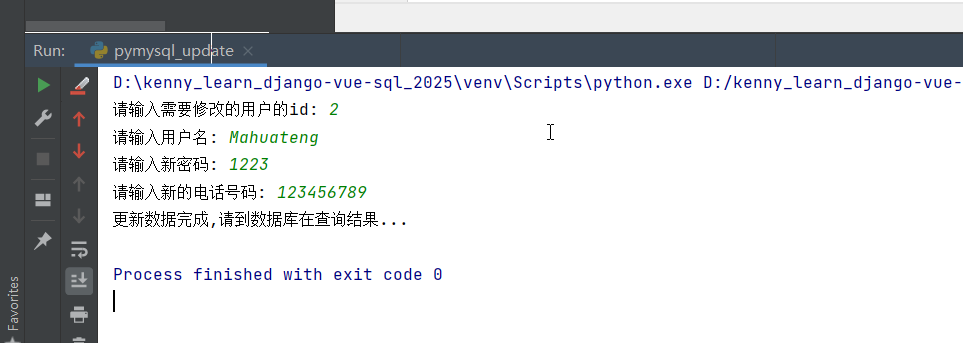

##### 我们到navicat中看看,修改数据成功

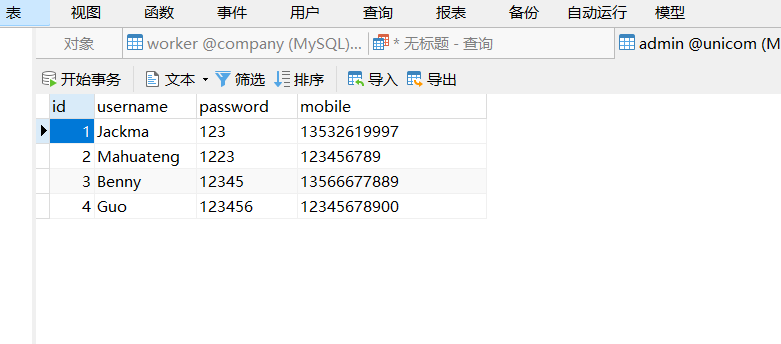

#### 用pymysql对的数据库的基本操作就是这些了,我们需要灵活引用,注意,除了查询以外,所有的操作都需要提交

| 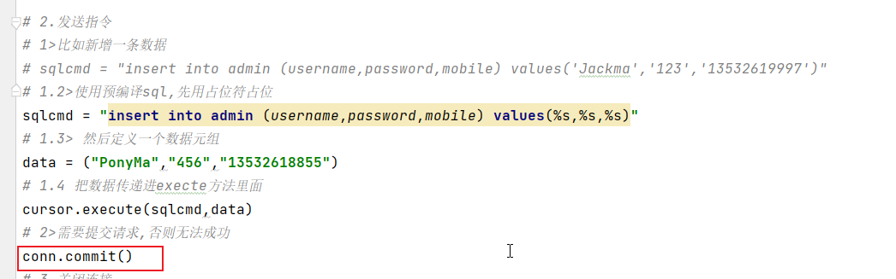 |
| ------------------------------------------------------------ |
| 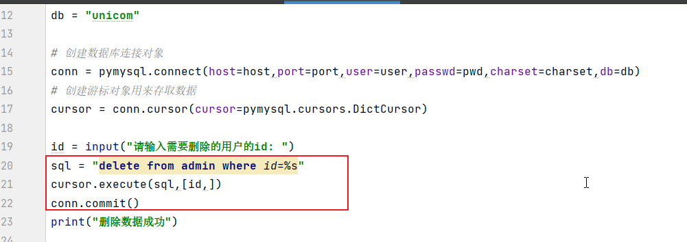 |
| 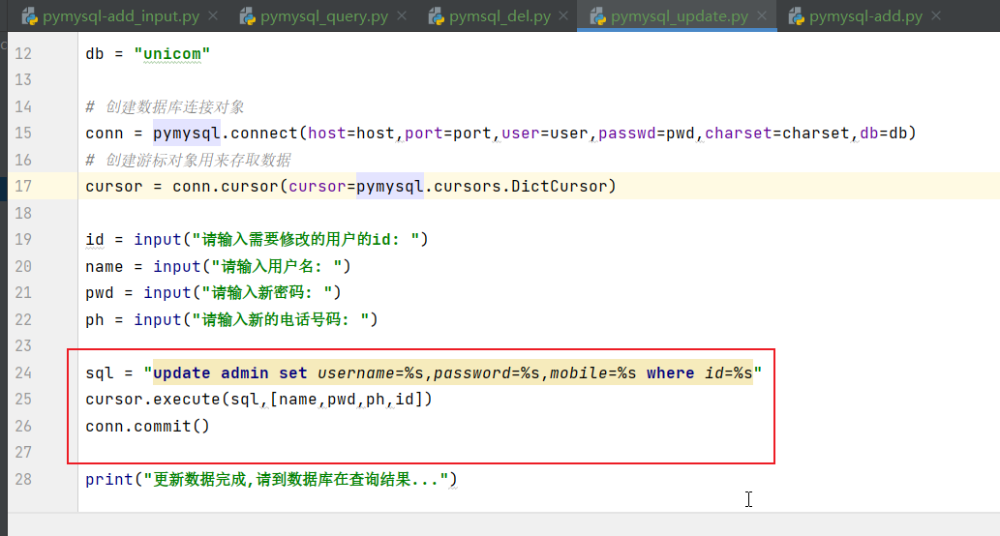 |

##### 执行查询操作后,需要去接收数据还有就是最后使用预编译sql来避免sql注入

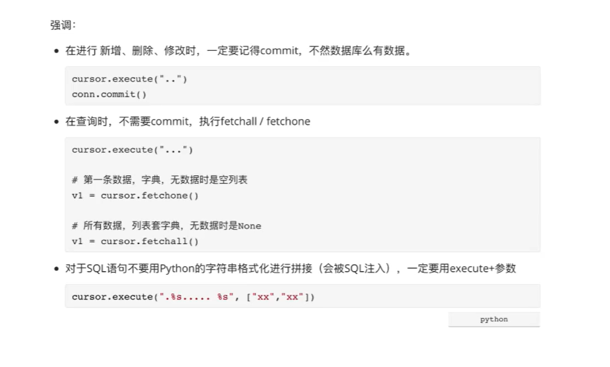
