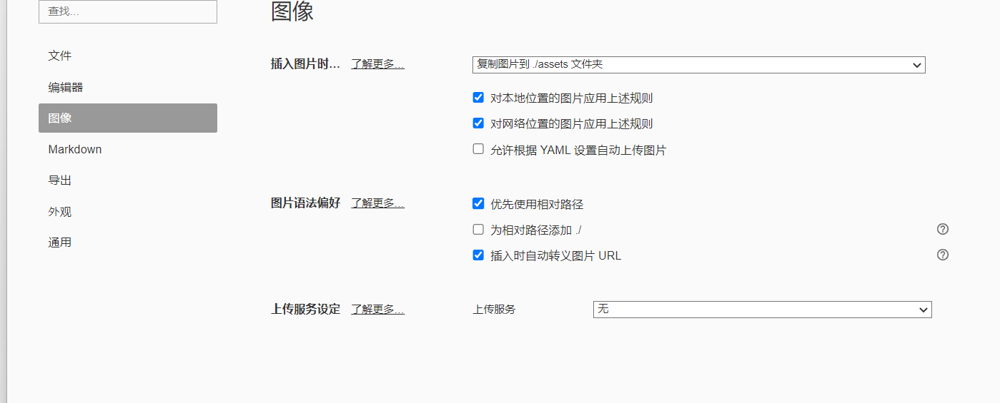

# 第一章 python基础

## 第一节 项目目录学习

### 项目的创建

<u>带下划线文本</u>

~~tencent.com~~

[^要注明的文本]:hello

```Javascript
let box = document.querySelector(".box")
```


## 第二节 第一个python程序

**这个是实例**

[百度一下](https://www.baidu.com)


```python
def showInfo(info):
    print(into)
```

## 第三节 开发环境搭建

- 下载python并且安装

  - 下载地址:www.python.org
  - 根据你的操作系统类型来选择对应的安装文件,我的是windows版本的
    - 可以选择msi可执行文件
      - x86也就是32位的安装文件
      - x64也就是64位的安装文件
    - 也可以使用zip压缩文件

- 查看python的版本

- 下载pycharm,当然还有别的选择,如:

  - eclipse + pydev插件
  - vscode+ python插件

- 配置python解析器

  1. 在pycharm在点击setting
  2. 然后点击解析器
  3. 然后可以选择应该现有的解析器或者创建应该虚拟环境

  


1. 学习Java
   1. 学习java基础
   2. 学习java进阶
   3. javaweb开发
2. 学习cpp
   + c++基础
   + c++进阶
   + c++ Qt学习
   + c++网络安全
3. 学习python
4. 学习js


```js
let myLangs = ["java","cpp","python]
myLangs.forEach(item=>{
   console.log(item)
})
```


在c++中我们是这样子输出内容的`cout<<"Hello"<<endl;`怎么样,觉得怪吗?

在python中我们是这样子的`print("Hello")`这个语义上比较好理解吧


我在下面添加一个截图


再测试一下




